# Design Document - Dashboard de Superadministrador

## Overview

El Dashboard de Superadministrador es una plataforma integral que combina funcionalidades administrativas avanzadas con dashboards ejecutivos interactivos, sistema de reportes automatizados, y capacidades de monitoreo en tiempo real. El sistema proporciona múltiples vistas especializadas: dashboard ejecutivo con KPIs estratégicos, matriz de riesgos interactiva, dashboards por proyecto y auditoría, sistema de alertas automatizadas, y herramientas de exportación multi-formato. El diseño se basa en la arquitectura hexagonal existente y extiende los patrones establecidos para soportar análisis avanzado y visualización de datos.

## Architecture

### High-Level Architecture

```mermaid
graph TB
    subgraph "Presentation Layer"
        CLI[CLI Script]
        ExecDash[Executive Dashboard]
        RiskMatrix[Interactive Risk Matrix]
        ProjectDash[Project Dashboards]
        AuditDash[Audit Dashboard]
        AdminDash[Admin Dashboard]
        UserMgmt[User Management]
        SysMon[System Monitoring]
        SysConfig[System Configuration]
        ReportGen[Report Generator]
        AlertConfig[Alert Configuration]
    end
    
    subgraph "Application Layer"
        AdminService[AdminService]
        DashboardService[DashboardService]
        ReportService[ReportService]
        AlertService[AlertService]
        UserMgmtService[UserManagementService]
        MonitoringService[MonitoringService]
        ConfigService[ConfigurationService]
        ExportService[ExportService]
        FilterService[FilterService]
    end
    
    subgraph "Domain Layer"
        Usuario[Usuario Entity]
        AdminUser[AdminUser Value Object]
        SystemMetrics[SystemMetrics Entity]
        AuditLog[AuditLog Entity]
        KPI[KPI Entity]
        RiskMatrix[RiskMatrix Entity]
        Report[Report Entity]
        Alert[Alert Entity]
        Filter[Filter Value Object]
    end
    
    subgraph "Infrastructure Layer"
        SupabaseRepo[Supabase Repository]
        AuthMiddleware[Auth Middleware]
        PermissionService[Permission Service]
        EmailService[Email Service]
        PDFGenerator[PDF Generator]
        ExcelGenerator[Excel Generator]
        RealtimeService[Realtime Service]
        CacheService[Cache Service]
    end
    
    CLI --> AdminService
    ExecDash --> DashboardService
    RiskMatrix --> DashboardService
    ProjectDash --> DashboardService
    AuditDash --> DashboardService
    AdminDash --> AdminService
    UserMgmt --> UserMgmtService
    SysMon --> MonitoringService
    SysConfig --> ConfigService
    ReportGen --> ReportService
    AlertConfig --> AlertService
    
    DashboardService --> KPI
    DashboardService --> RiskMatrix
    ReportService --> Report
    AlertService --> Alert
    AdminService --> Usuario
    UserMgmtService --> Usuario
    MonitoringService --> SystemMetrics
    ConfigService --> AuditLog
    
    DashboardService --> SupabaseRepo
    ReportService --> PDFGenerator
    ReportService --> ExcelGenerator
    AlertService --> EmailService
    AdminService --> SupabaseRepo
    UserMgmtService --> SupabaseRepo
    MonitoringService --> SupabaseRepo
    ConfigService --> SupabaseRepo
    
    DashboardService --> RealtimeService
    DashboardService --> CacheService
```



### Component Integration

El diseño se integra con los componentes existentes:
- **AuthService**: Para autenticación y gestión de sesiones
- **RoleService**: Para verificación de permisos administrativos
- **PermissionService**: Para control de acceso granular
- **Usuario Entity**: Entidad existente para gestión de usuarios
- **Supabase Infrastructure**: Base de datos y autenticación existente

## Components and Interfaces

### 1. CLI Script Component

**Propósito**: Script de línea de comandos para crear usuarios superadmin

**Ubicación**: `scripts/create-superadmin.js`

**Interface**:
```typescript
interface CreateSuperAdminOptions {
  email: string
  password: string
  nombres: string
  apellidos: string
  ci: string
  telefono?: string
  departamento?: string
}

interface CreateSuperAdminResult {
  success: boolean
  userId?: number
  credentials?: {
    email: string
    temporaryPassword?: string
  }
  error?: string
}
```

### 2. Executive Dashboard Component

**Propósito**: Dashboard ejecutivo con KPIs estratégicos para toma de decisiones

**Ubicación**: `app/admin/executive/page.tsx`

**Features**:
- KPIs principales en tiempo real (total riesgos, riesgos críticos, cumplimiento normativo)
- Gráficos de tendencias de riesgos (12 meses)
- Drill-down interactivo en métricas
- Actualización automática cada 5 minutos
- Análisis de causa raíz integrado

**Interface**:
```typescript
interface ExecutiveKPIs {
  totalRisks: number
  criticalRisks: number
  compliancePercentage: number
  riskTrends: RiskTrendData[]
  lastUpdated: Date
}

interface RiskTrendData {
  month: string
  totalRisks: number
  criticalRisks: number
  mitigatedRisks: number
}
```

### 3. Interactive Risk Matrix Component

**Propósito**: Visualización interactiva de matriz de riesgos con heat map

**Ubicación**: `app/admin/risk-matrix/page.tsx`

**Features**:
- Heat map 5x5 con código de colores (verde, amarillo, naranja, rojo)
- Click en cuadrantes para drill-down
- Filtros por proyecto, categoría, responsable
- Detalles de riesgos con planes de mitigación
- Exportación de matriz en múltiples formatos

**Interface**:
```typescript
interface RiskMatrixData {
  matrix: RiskCell[][]
  filters: RiskMatrixFilters
  totalRisks: number
}

interface RiskCell {
  probability: number
  impact: number
  riskCount: number
  risks: RiskSummary[]
  colorCode: 'green' | 'yellow' | 'orange' | 'red'
}

interface RiskMatrixFilters {
  projectId?: number
  category?: string
  responsibleId?: number
  dateRange?: DateRange
}
```

### 4. Project Dashboard Component

**Propósito**: Dashboard específico por proyecto con riesgos asociados

**Ubicación**: `app/admin/projects/[id]/dashboard/page.tsx`

**Features**:
- Métricas específicas del proyecto
- Timeline de eventos de riesgo
- Comparación entre proyectos
- Impacto en objetivos del proyecto
- Filtrado por proyecto específico

**Interface**:
```typescript
interface ProjectDashboardData {
  projectId: number
  projectName: string
  totalRisks: number
  criticalRisks: number
  overdueActivities: number
  progressPercentage: number
  riskTimeline: RiskEvent[]
  projectComparison?: ProjectComparison[]
}
```

### 5. Audit Dashboard Component

**Propósito**: Dashboard de auditoría con seguimiento de hallazgos

**Ubicación**: `app/admin/audit/dashboard/page.tsx`

**Features**:
- Resumen de hallazgos (abiertos, en progreso, cerrados, vencidos)
- Seguimiento de acciones correctivas
- Alertas automáticas para vencimientos
- Métricas de efectividad de controles
- Evidencias cargadas por hallazgo

**Interface**:
```typescript
interface AuditDashboardData {
  findingsSummary: FindingsSummary
  correctiveActions: CorrectiveAction[]
  controlEffectiveness: ControlMetrics[]
  upcomingDeadlines: AuditDeadline[]
}

interface FindingsSummary {
  open: number
  inProgress: number
  closed: number
  overdue: number
}
```

### 6. Report Generator Component

**Propósito**: Generación automatizada de reportes en múltiples formatos

**Ubicación**: `app/admin/reports/page.tsx`

**Features**:
- Reportes de matriz de riesgos
- Reportes de planes de mitigación
- Reportes de auditoría y hallazgos
- Reportes de cumplimiento normativo
- Exportación en PDF, Excel, CSV

**Interface**:
```typescript
interface ReportGenerationRequest {
  type: ReportType
  format: 'pdf' | 'excel' | 'csv'
  filters: ReportFilters
  includeGraphics: boolean
  digitalSignature: boolean
}

enum ReportType {
  RISK_MATRIX = 'risk_matrix',
  MITIGATION_PLANS = 'mitigation_plans',
  AUDIT_FINDINGS = 'audit_findings',
  COMPLIANCE = 'compliance'
}
```

### 7. Alert Configuration Component

**Propósito**: Configuración y gestión del sistema de alertas automatizadas

**Ubicación**: `app/admin/alerts/config/page.tsx`

**Features**:
- Configuración de reglas de alerta
- Canales de notificación (email, dashboard, webhooks)
- Alertas por nivel de criticidad
- Recordatorios automáticos de vencimientos
- Detección de actividad sospechosa

**Interface**:
```typescript
interface AlertRule {
  id: number
  name: string
  eventType: AlertEventType
  conditions: AlertCondition[]
  channels: NotificationChannel[]
  isActive: boolean
}

enum AlertEventType {
  CRITICAL_RISK = 'critical_risk',
  ACTIVITY_DEADLINE = 'activity_deadline',
  SUSPICIOUS_ACTIVITY = 'suspicious_activity',
  SYSTEM_ERROR = 'system_error'
}
```

### 8. Interactive Filter System

**Propósito**: Sistema de filtros interactivos para todos los dashboards

**Ubicación**: `components/admin/filters/InteractiveFilters.tsx`

**Features**:
- Filtros de fecha con actualización en tiempo real
- Múltiples filtros simultáneos con lógica AND
- Indicadores visuales de filtros activos
- Vistas personalizadas guardadas
- Persistencia de filtros entre navegación

**Interface**:
```typescript
interface FilterState {
  dateRange?: DateRange
  projectIds?: number[]
  categories?: string[]
  responsibleIds?: number[]
  riskLevels?: RiskLevel[]
  customFilters?: CustomFilter[]
}

interface SavedView {
  id: number
  name: string
  filters: FilterState
  userId: number
  isDefault: boolean
}
```

### 9. Export Service Component

**Propósito**: Servicio de exportación multi-formato con metadatos

**Ubicación**: `src/application/services/ExportService.ts`

**Features**:
- Exportación PDF con gráficos y formato visual
- Exportación Excel con hojas separadas y fórmulas
- Exportación CSV con headers descriptivos
- Metadatos de exportación incluidos
- Firma digital para reportes oficiales

**Interface**:
```typescript
interface ExportOptions {
  format: ExportFormat
  includeMetadata: boolean
  includeGraphics: boolean
  digitalSignature?: boolean
  customTemplate?: string
}

interface ExportMetadata {
  generatedAt: Date
  generatedBy: string
  filtersApplied: FilterState
  dataRange: DateRange
  recordCount: number
}
```

## Data Models

### AdminUser Value Object

```typescript
export class AdminUser {
  constructor(
    private readonly usuario: Usuario,
    private readonly permissions: AdminPermission[]
  ) {}

  canManageUsers(): boolean
  canViewSystemLogs(): boolean
  canModifySystemConfig(): boolean
  canAccessExecutiveDashboard(): boolean
  canGenerateReports(): boolean
  canConfigureAlerts(): boolean
  getAdminLevel(): AdminLevel
}

export enum AdminLevel {
  SUPER_ADMIN = 'super_admin',
  SYSTEM_ADMIN = 'system_admin',
  USER_ADMIN = 'user_admin'
}
```

### KPI Entity

```typescript
export interface KPIProps {
  id: number
  name: string
  value: number
  target?: number
  unit: string
  category: KPICategory
  trend: TrendDirection
  lastUpdated: Date
  drillDownData?: any
}

export class KPI {
  constructor(private readonly props: KPIProps) {}
  
  getValue(): number
  getFormattedValue(): string
  getTrendPercentage(): number
  isOnTarget(): boolean
  getDrillDownData(): any
}

export enum KPICategory {
  RISK_MANAGEMENT = 'risk_management',
  COMPLIANCE = 'compliance',
  OPERATIONAL = 'operational',
  FINANCIAL = 'financial'
}

export enum TrendDirection {
  UP = 'up',
  DOWN = 'down',
  STABLE = 'stable'
}
```

### RiskMatrix Entity

```typescript
export interface RiskMatrixProps {
  id: number
  projectId?: number
  matrixData: RiskCell[][]
  filters: RiskMatrixFilters
  generatedAt: Date
  totalRisks: number
}

export class RiskMatrix {
  constructor(private readonly props: RiskMatrixProps) {}
  
  getCellByCoordinates(probability: number, impact: number): RiskCell
  getRisksByLevel(level: RiskLevel): RiskSummary[]
  getColorDistribution(): ColorDistribution
  applyFilters(filters: RiskMatrixFilters): RiskMatrix
  exportToFormat(format: ExportFormat): ExportResult
}

export interface RiskCell {
  probability: number
  impact: number
  riskCount: number
  risks: RiskSummary[]
  riskLevel: number
  colorCode: MatrixColor
}

export enum MatrixColor {
  GREEN = 'green',    // 1-4
  YELLOW = 'yellow',  // 5-9
  ORANGE = 'orange',  // 10-15
  RED = 'red'         // 16-25
}
```

### Report Entity

```typescript
export interface ReportProps {
  id: number
  type: ReportType
  title: string
  generatedBy: number
  generatedAt: Date
  filters: ReportFilters
  format: ExportFormat
  filePath?: string
  metadata: ReportMetadata
  digitalSignature?: string
}

export class Report {
  constructor(private readonly props: ReportProps) {}
  
  generate(): Promise<ReportResult>
  addDigitalSignature(): void
  getMetadata(): ReportMetadata
  isExpired(): boolean
  getDownloadUrl(): string
}

export interface ReportMetadata {
  dataRange: DateRange
  recordCount: number
  filtersApplied: string[]
  generationTime: number
  fileSize?: number
}
```

### Alert Entity

```typescript
export interface AlertProps {
  id: number
  ruleId: number
  eventType: AlertEventType
  severity: AlertSeverity
  title: string
  message: string
  targetUserId?: number
  relatedEntityId?: number
  relatedEntityType?: string
  isRead: boolean
  isSent: boolean
  createdAt: Date
  sentAt?: Date
  channels: NotificationChannel[]
}

export class Alert {
  constructor(private readonly props: AlertProps) {}
  
  send(): Promise<void>
  markAsRead(): void
  markAsSent(): void
  shouldSend(): boolean
  getRecipients(): User[]
}

export enum AlertSeverity {
  LOW = 'low',
  MEDIUM = 'medium',
  HIGH = 'high',
  CRITICAL = 'critical'
}

export enum NotificationChannel {
  EMAIL = 'email',
  DASHBOARD = 'dashboard',
  WEBHOOK = 'webhook',
  SMS = 'sms'
}
```

### SystemMetrics Entity (Enhanced)

```typescript
export interface SystemMetricsProps {
  id: number
  totalUsers: number
  activeUsers: number
  totalRisks: number
  criticalRisks: number
  highRisks: number
  mediumRisks: number
  lowRisks: number
  totalProjects: number
  activeProjects: number
  completedProjects: number
  totalFindings: number
  openFindings: number
  overdueFindings: number
  compliancePercentage: number
  systemErrors: number
  lastBackup: Date
  systemUptime: number
  timestamp: Date
}

export class SystemMetrics {
  constructor(private readonly props: SystemMetricsProps) {}
  
  getTotalUsers(): number
  getActiveUsers(): number
  getUserGrowthRate(): number
  getRiskDistribution(): RiskDistribution
  getComplianceStatus(): ComplianceStatus
  getSystemHealth(): SystemHealth
  getExecutiveKPIs(): ExecutiveKPIs
  getProjectMetrics(): ProjectMetrics
  getAuditMetrics(): AuditMetrics
}

export interface ExecutiveKPIs {
  totalRisks: number
  criticalRisks: number
  compliancePercentage: number
  riskTrends: RiskTrendData[]
  lastUpdated: Date
}
```

### Filter Value Object

```typescript
export class Filter {
  constructor(
    private readonly criteria: FilterCriteria[],
    private readonly logic: FilterLogic = FilterLogic.AND
  ) {}
  
  apply<T>(data: T[]): T[]
  addCriteria(criteria: FilterCriteria): Filter
  removeCriteria(key: string): Filter
  serialize(): string
  static deserialize(serialized: string): Filter
}

export interface FilterCriteria {
  key: string
  operator: FilterOperator
  value: any
  type: FilterType
}

export enum FilterOperator {
  EQUALS = 'equals',
  NOT_EQUALS = 'not_equals',
  GREATER_THAN = 'greater_than',
  LESS_THAN = 'less_than',
  CONTAINS = 'contains',
  IN = 'in',
  BETWEEN = 'between'
}

export enum FilterType {
  STRING = 'string',
  NUMBER = 'number',
  DATE = 'date',
  BOOLEAN = 'boolean',
  ARRAY = 'array'
}
```

### AuditLog Entity (Extension)

```typescript
export interface AdminAuditLogProps extends AuditLogProps {
  adminAction: AdminAction
  targetUserId?: number
  systemConfigChanged?: string
  securityLevel: SecurityLevel
  dashboardAccessed?: string
  reportGenerated?: ReportType
  alertConfigured?: number
}

export enum AdminAction {
  USER_CREATED = 'user_created',
  USER_MODIFIED = 'user_modified',
  USER_DEACTIVATED = 'user_deactivated',
  ROLE_CHANGED = 'role_changed',
  CONFIG_MODIFIED = 'config_modified',
  SYSTEM_BACKUP = 'system_backup',
  DASHBOARD_ACCESSED = 'dashboard_accessed',
  REPORT_GENERATED = 'report_generated',
  ALERT_CONFIGURED = 'alert_configured',
  DATA_EXPORTED = 'data_exported'
}
```

## Error Handling

### Error Types

```typescript
export class AdminError extends Error {
  constructor(
    message: string,
    public readonly code: AdminErrorCode,
    public readonly details?: any
  ) {
    super(message)
  }
}

export enum AdminErrorCode {
  INSUFFICIENT_PERMISSIONS = 'insufficient_permissions',
  USER_CREATION_FAILED = 'user_creation_failed',
  INVALID_ADMIN_ACTION = 'invalid_admin_action',
  SYSTEM_CONFIG_ERROR = 'system_config_error',
  AUDIT_LOG_ERROR = 'audit_log_error'
}
```

### Error Handling Strategy

1. **CLI Errors**: Mostrar mensajes descriptivos en consola con códigos de salida apropiados
2. **Dashboard Errors**: Mostrar notificaciones toast con opciones de reintento
3. **API Errors**: Retornar respuestas HTTP estructuradas con códigos de error
4. **System Errors**: Registrar en logs de auditoría y notificar a administradores

## Testing Strategy

### Unit Tests

```typescript
// Ejemplo de test para AdminService
describe('AdminService', () => {
  describe('createSuperAdmin', () => {
    it('should create superadmin with valid data')
    it('should reject duplicate email')
    it('should validate CI format')
    it('should assign ADMINISTRADOR role')
  })
  
  describe('getUserMetrics', () => {
    it('should return current user statistics')
    it('should calculate growth rates correctly')
  })
})
```

### Integration Tests

```typescript
// Ejemplo de test de integración
describe('Admin Dashboard Integration', () => {
  it('should load dashboard with admin permissions')
  it('should restrict access for non-admin users')
  it('should display real-time metrics')
  it('should handle user management operations')
})
```

### E2E Tests

```typescript
// Ejemplo de test E2E
describe('Superadmin Workflow', () => {
  it('should create superadmin via CLI')
  it('should login and access admin dashboard')
  it('should create and manage users')
  it('should monitor system activity')
  it('should modify system configuration')
})
```

## Security Considerations

### Authentication & Authorization

1. **Multi-Factor Authentication**: Requerir MFA para usuarios administradores
2. **Session Management**: Sesiones administrativas con timeout reducido
3. **Permission Validation**: Verificación de permisos en cada operación
4. **Audit Trail**: Registro completo de todas las acciones administrativas

### Data Protection

1. **Sensitive Data**: Encriptar datos sensibles en tránsito y reposo
2. **Access Logging**: Registrar todos los accesos a datos administrativos
3. **Data Masking**: Enmascarar información sensible en logs
4. **Backup Security**: Encriptar backups del sistema

### Rate Limiting

```typescript
export interface AdminRateLimit {
  userCreation: { requests: 10, window: '1h' }
  configChanges: { requests: 5, window: '1h' }
  bulkOperations: { requests: 3, window: '1h' }
}
```

## Performance Optimization

### Caching Strategy

1. **Executive KPIs**: Cache por 5 minutos con invalidación automática
2. **Risk Matrix Data**: Cache por 10 minutos, invalidar al actualizar riesgos
3. **Project Dashboards**: Cache por 15 minutos por proyecto
4. **Audit Metrics**: Cache por 30 minutos con invalidación manual
5. **System Configuration**: Cache hasta cambio manual
6. **Report Templates**: Cache permanente con versionado
7. **Filter Results**: Cache por 2 minutos para consultas repetidas
8. **User Metrics**: Cache por 5 minutos

### Real-time Updates

```typescript
interface RealtimeConfig {
  executiveDashboard: { interval: 300000 } // 5 minutos
  riskMatrix: { interval: 600000 } // 10 minutos
  auditDashboard: { interval: 900000 } // 15 minutos
  alerts: { realtime: true } // Tiempo real
}
```

### Database Optimization

1. **Specialized Indexes**: 
   - Índices compuestos para consultas de dashboard
   - Índices parciales para datos activos
   - Índices de texto completo para búsquedas
2. **Partitioning**: 
   - Particionar logs de auditoría por fecha
   - Particionar métricas históricas por mes
3. **Connection Pooling**: 
   - Pool dedicado para operaciones administrativas
   - Pool separado para reportes pesados
4. **Query Optimization**: 
   - Vistas materializadas para KPIs complejos
   - Consultas optimizadas para agregaciones
   - Paginación eficiente para listas grandes

### Frontend Optimization

1. **Component Lazy Loading**: Cargar dashboards bajo demanda
2. **Data Virtualization**: Para listas grandes de datos
3. **Chart Optimization**: Renderizado eficiente de gráficos
4. **Bundle Splitting**: Separar código por funcionalidad
5. **Service Workers**: Cache de assets estáticos

## Deployment Considerations

### Environment Configuration

```typescript
export interface AdminConfig {
  enableCLIAccess: boolean
  maxAdminSessions: number
  auditLogRetention: number // días
  backupFrequency: string // cron expression
  securityAlerts: {
    email: string[]
    webhook?: string
  }
}
```

### Monitoring & Alerting

1. **Health Checks**: Endpoints para verificar estado del sistema
2. **Metrics Collection**: Métricas de uso y rendimiento
3. **Alert Rules**: Reglas para detectar anomalías
4. **Dashboard Monitoring**: Monitoreo de disponibilidad del dashboard

### Backup & Recovery

1. **Automated Backups**: Backups automáticos de configuración
2. **Point-in-Time Recovery**: Capacidad de restaurar a punto específico
3. **Disaster Recovery**: Plan de recuperación ante desastres
4. **Data Validation**: Validación de integridad de backups