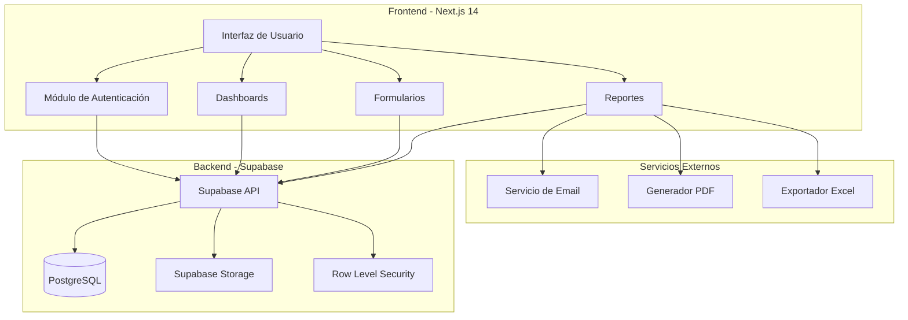
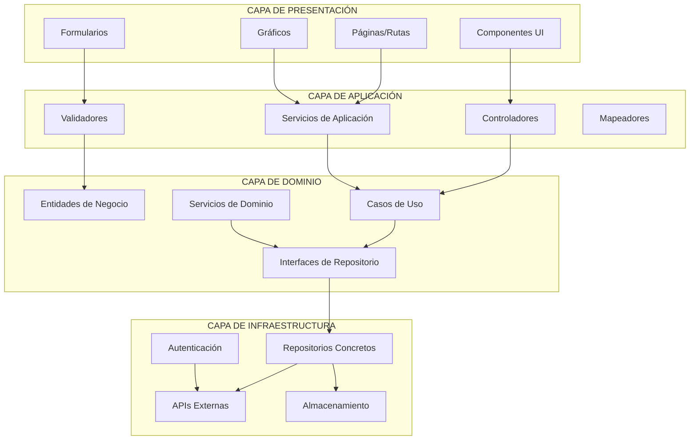
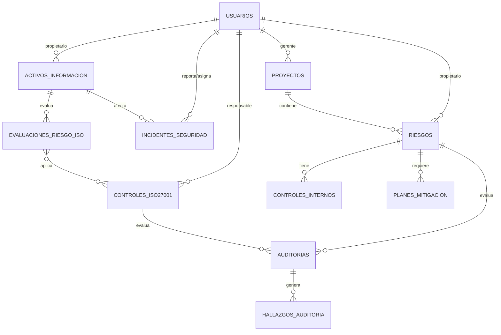

# Documento de Diseño - Sistema de Gestión de Riesgos COSO II

## Resumen Ejecutivo

El Sistema de Gestión de Riesgos COSO II para DELTA CONSULT LTDA será una aplicación web moderna construida con Next.js 14+ y Supabase, diseñada para proporcionar una gestión integral de riesgos empresariales y de proyectos siguiendo el marco COSO ERM 2017 integrado con ISO 27001 para la gestión de seguridad de la información. La arquitectura seguirá principios de diseño modular, escalabilidad y seguridad empresarial, cumpliendo con estándares internacionales de gestión de riesgos y seguridad.

## Arquitectura del Sistema

### Arquitectura General



### Arquitectura por Capas Modular



#### 1. **Capa de Presentación** (Frontend - Next.js)

- **Responsabilidad**: Interfaz de usuario y experiencia
- **Componentes**:
  - Páginas y layouts
  - Componentes React reutilizables
  - Formularios con validación
  - Dashboards y visualizaciones
- **Tecnologías**: Next.js 14, React, TypeScript, Tailwind CSS

#### 2. **Capa de Aplicación** (Orquestación)

- **Responsabilidad**: Coordinación de flujos de trabajo
- **Componentes**:
  - Controladores de API Routes
  - Servicios de aplicación
  - DTOs (Data Transfer Objects)
  - Validadores de entrada
- **Tecnologías**: Next.js API Routes, Zod, React Hook Form

#### 3. **Capa de Dominio** (Lógica de Negocio)

- **Responsabilidad**: Reglas de negocio y entidades
- **Componentes**:
  - Entidades de dominio (Usuario, Riesgo, Proyecto)
  - Casos de uso específicos
  - Interfaces de repositorio
  - Servicios de dominio (cálculos, validaciones)
- **Tecnologías**: TypeScript puro, sin dependencias externas

#### 4. **Capa de Infraestructura** (Persistencia y Servicios)

- **Responsabilidad**: Acceso a datos y servicios externos
- **Componentes**:
  - Implementaciones de repositorios
  - Clientes de base de datos
  - Servicios de autenticación
  - Integración con APIs externas
- **Tecnologías**: Supabase, PostgreSQL, Servicios de email

## Componentes y Interfaces

### Estructura de Módulos

```
src/
├── app/                    # App Router de Next.js
│   ├── (auth)/            # Grupo de rutas de autenticación
│   ├── dashboard/         # Dashboard principal
│   ├── proyectos/         # Gestión de proyectos
│   ├── riesgos/          # Gestión de riesgos
│   ├── auditorias/       # Módulo de auditorías
│   └── reportes/         # Reportes y analytics
├── components/            # Componentes reutilizables
│   ├── ui/               # Componentes base (shadcn/ui)
│   ├── forms/            # Formularios específicos
│   ├── charts/           # Gráficos y visualizaciones
│   └── layout/           # Componentes de layout
├── lib/                  # Utilidades y configuraciones
│   ├── supabase/         # Cliente y tipos de Supabase
│   ├── validations/      # Esquemas de validación (Zod)
│   ├── utils/            # Funciones utilitarias
│   └── constants/        # Constantes del sistema
├── hooks/                # Custom hooks
├── stores/               # Estados globales (Zustand)
└── types/                # Definiciones de tipos TypeScript
```

### Componentes Principales

#### 1. Sistema de Autenticación

```typescript
interface AuthSystem {
  // Autenticación tradicional
  login(credentials: LoginCredentials): Promise<AuthResult>
  logout(): Promise<void>
  resetPassword(email: string): Promise<void>

  // Autenticación OAuth
  loginWithGoogle(): Promise<AuthResult>
  loginWithLinkedIn(): Promise<AuthResult>
  loginWithGitHub(): Promise<AuthResult>

  // Permisos y autorización
  checkPermissions(module: string, action: string): boolean
  getUserProfile(): Promise<UserProfile>
}

interface LoginCredentials {
  email: string
  password: string
}

interface AuthResult {
  success: boolean
  user?: UserProfile
  error?: string
  requiresEmailConfirmation?: boolean
}

interface OAuthProvider {
  name: 'google' | 'linkedin' | 'github'
  displayName: string
  icon: string
  enabled: boolean
}
```

#### 2. Gestión de Riesgos

```typescript
interface RiskManagement {
  createRisk(risk: CreateRiskInput): Promise<Risk>
  updateRisk(id: string, updates: UpdateRiskInput): Promise<Risk>
  calculateRiskLevel(probability: number, impact: number): number
  generateRiskMatrix(): Promise<RiskMatrix>
}
```

#### 3. Gestión ISO 27001

```typescript
interface ISO27001Management {
  // Gestión de Activos
  createAsset(asset: CreateAssetInput): Promise<ActivoInformacion>
  updateAsset(id: number, updates: UpdateAssetInput): Promise<ActivoInformacion>
  classifyAsset(id: number, classification: string): Promise<void>

  // Gestión de Controles
  implementControl(control: CreateControlInput): Promise<ControlISO27001>
  assessControlMaturity(id: number, maturity: number): Promise<void>
  linkControlToRisk(controlId: number, riskId: number): Promise<void>

  // Evaluación de Riesgos ISO
  performRiskAssessment(assessment: RiskAssessmentInput): Promise<EvaluacionRiesgoISO>
  calculateInherentRisk(probability: number, impacts: CIAImpact): number
  calculateResidualRisk(inherentRisk: number, controls: ControlISO27001[]): number

  // Gestión de Incidentes
  reportIncident(incident: CreateIncidentInput): Promise<IncidenteSeguridad>
  investigateIncident(id: number, findings: string): Promise<void>
  closeIncident(id: number, resolution: string): Promise<void>
}

interface CIAImpact {
  confidentiality: number
  integrity: number
  availability: number
}
```

#### 4. Dashboard y Reportes

```typescript
interface DashboardService {
  getExecutiveDashboard(): Promise<ExecutiveDashboard>
  getProjectDashboard(projectId: string): Promise<ProjectDashboard>
  getISO27001Dashboard(): Promise<ISO27001Dashboard>
  generateReport(type: ReportType, filters: ReportFilters): Promise<Report>
  exportReport(reportId: string, format: ExportFormat): Promise<Blob>
}

interface ISO27001Dashboard {
  totalAssets: number
  criticalAssets: number
  controlsImplemented: number
  controlsTotal: number
  averageMaturityLevel: number
  openIncidents: number
  risksByTreatment: RiskTreatmentStats
  complianceScore: number
}
```

## Modelos de Datos

### Entidades Principales

#### Usuario

```typescript
interface Usuario {
  id_usuario: number
  id_rol: number
  id_departamento: number
  nombres: string
  apellido_paterno: string
  apellido_materno?: string
  ci: string
  correo_electronico: string
  telefono_contacto?: string
  fecha_ingreso_empresa?: Date
  estado_usuario: 'activo' | 'inactivo'
  url_foto_perfil?: string
}
```

#### Riesgo

```typescript
interface Riesgo {
  id_riesgo: number
  id_proyecto?: number
  id_categoria_riesgo: number
  id_tipo_riesgo: number
  id_propietario_riesgo: number
  titulo_riesgo: string
  descripcion_riesgo: string
  causa_raiz_riesgo?: string
  consecuencia_riesgo?: string
  valor_probabilidad: number // 1-5
  valor_impacto: number // 1-5
  nivel_riesgo_calculado: number // probabilidad × impacto
  fecha_registro_riesgo: Date
  fecha_actualizacion_riesgo: Date
}
```

#### Proyecto

```typescript
interface Proyecto {
  id_proyecto: number
  id_cliente: number
  nombre_proyecto: string
  descripcion_proyecto?: string
  presupuesto_proyecto?: number
  fecha_inicio_proyecto: Date
  fecha_fin_estimada_proyecto?: Date
  fecha_fin_real_proyecto?: Date
  estado_proyecto: 'planificado' | 'en_progreso' | 'completado' | 'cancelado'
  porcentaje_avance_proyecto: number
  id_gerente_proyecto: number
}
```

### Entidades ISO 27001

#### Activo de Información

```typescript
interface ActivoInformacion {
  id_activo: number
  nombre_activo: string
  descripcion_activo: string
  tipo_activo: 'hardware' | 'software' | 'datos' | 'servicios' | 'personas' | 'instalaciones'
  clasificacion_seguridad: 'publico' | 'interno' | 'confidencial' | 'restringido'
  propietario_activo: number // id_usuario
  custodio_activo?: number // id_usuario
  ubicacion_activo?: string
  valor_activo: number // 1-5 escala de criticidad
  estado_activo: 'activo' | 'inactivo' | 'retirado'
  fecha_registro: Date
  fecha_actualizacion: Date
}
```

#### Control ISO 27001

```typescript
interface ControlISO27001 {
  id_control: number
  codigo_control: string // A.5.1, A.6.1, etc.
  nombre_control: string
  descripcion_control: string
  dominio_control: string // A.5 Políticas de seguridad, A.6 Organización, etc.
  tipo_control: 'preventivo' | 'detectivo' | 'correctivo'
  categoria_control: 'tecnico' | 'administrativo' | 'fisico'
  estado_implementacion:
    | 'no_implementado'
    | 'parcialmente_implementado'
    | 'implementado'
    | 'no_aplicable'
  nivel_madurez: number // 0-5
  responsable_control: number // id_usuario
  fecha_implementacion?: Date
  fecha_revision: Date
  evidencias_control?: string[]
}
```

#### Evaluación de Riesgos ISO 27001

```typescript
interface EvaluacionRiesgoISO {
  id_evaluacion: number
  id_activo: number
  amenaza: string
  vulnerabilidad: string
  probabilidad_iso: number // 1-5
  impacto_confidencialidad: number // 1-5
  impacto_integridad: number // 1-5
  impacto_disponibilidad: number // 1-5
  riesgo_inherente: number // calculado
  controles_aplicables: number[] // ids de controles
  riesgo_residual: number // calculado después de controles
  nivel_riesgo_aceptable: boolean
  tratamiento_riesgo: 'aceptar' | 'mitigar' | 'transferir' | 'evitar'
  justificacion_tratamiento?: string
  fecha_evaluacion: Date
  evaluador: number // id_usuario
}
```

#### Incidente de Seguridad

```typescript
interface IncidenteSeguridad {
  id_incidente: number
  titulo_incidente: string
  descripcion_incidente: string
  tipo_incidente:
    | 'acceso_no_autorizado'
    | 'malware'
    | 'phishing'
    | 'perdida_datos'
    | 'denegacion_servicio'
    | 'otro'
  severidad_incidente: 'baja' | 'media' | 'alta' | 'critica'
  estado_incidente: 'reportado' | 'en_investigacion' | 'contenido' | 'resuelto' | 'cerrado'
  activos_afectados: number[] // ids de activos
  fecha_deteccion: Date
  fecha_reporte: Date
  reportado_por: number // id_usuario
  asignado_a: number // id_usuario
  impacto_negocio: string
  acciones_inmediatas: string
  causa_raiz?: string
  lecciones_aprendidas?: string
  fecha_resolucion?: Date
}
```

### Relaciones Clave



## Gestión de Estados

### Estados Globales (Zustand)

```typescript
// Estado de autenticación
interface AuthStore {
  user: Usuario | null
  session: Session | null
  permissions: Permission[]
  login: (credentials: LoginCredentials) => Promise<void>
  logout: () => Promise<void>
  checkPermission: (module: string, action: string) => boolean
}

// Estado de riesgos
interface RiskStore {
  risks: Riesgo[]
  selectedRisk: Riesgo | null
  filters: RiskFilters
  setRisks: (risks: Riesgo[]) => void
  addRisk: (risk: Riesgo) => void
  updateRisk: (id: number, updates: Partial<Riesgo>) => void
  setFilters: (filters: RiskFilters) => void
}

// Estado de notificaciones
interface NotificationStore {
  notifications: Notification[]
  unreadCount: number
  addNotification: (notification: Notification) => void
  markAsRead: (id: string) => void
  clearAll: () => void
}
```

## Seguridad y Control de Acceso

### Row Level Security (RLS)

```sql
-- Política para usuarios - solo pueden ver su propio perfil
CREATE POLICY "usuarios_self_access" ON usuarios
FOR ALL USING (auth.uid()::text = id_usuario::text);

-- Política para riesgos - acceso basado en rol y proyecto
CREATE POLICY "riesgos_access" ON riesgos
FOR ALL USING (
  EXISTS (
    SELECT 1 FROM usuarios u
    WHERE u.id_usuario = auth.uid()::integer
    AND (
      u.id_rol IN (1, 2) -- superadmin, admin
      OR (u.id_rol = 3 AND EXISTS ( -- gerente de proyecto
        SELECT 1 FROM proyectos p
        WHERE p.id_proyecto = riesgos.id_proyecto
        AND p.id_gerente_proyecto = u.id_usuario
      ))
      OR riesgos.id_propietario_riesgo = u.id_usuario -- propietario del riesgo
    )
  )
);
```

### Validaciones de Seguridad

```typescript
// Validación de entrada con Zod
const createRiskSchema = z.object({
  titulo_riesgo: z.string().min(10).max(300),
  descripcion_riesgo: z.string().min(20),
  valor_probabilidad: z.number().int().min(1).max(5),
  valor_impacto: z.number().int().min(1).max(5),
  id_categoria_riesgo: z.number().int().positive(),
  id_propietario_riesgo: z.number().int().positive(),
})

// Middleware de autorización
export function withAuth(requiredPermission: string) {
  return async (req: NextRequest) => {
    const session = await getSession(req)
    if (!session || !hasPermission(session.user, requiredPermission)) {
      return new Response('Unauthorized', { status: 401 })
    }
  }
}
```

### Configuración OAuth

```typescript
// Configuración de proveedores OAuth
const oauthProviders: OAuthProvider[] = [
  {
    name: 'google',
    displayName: 'Google',
    icon: 'google',
    enabled: true,
  },
  {
    name: 'linkedin',
    displayName: 'LinkedIn',
    icon: 'linkedin',
    enabled: true,
  },
  {
    name: 'github',
    displayName: 'GitHub',
    icon: 'github',
    enabled: true,
  },
]

// Servicio de autenticación OAuth
export class OAuthService {
  static async signInWithProvider(provider: 'google' | 'linkedin' | 'github') {
    const supabase = createClient()

    const { data, error } = await supabase.auth.signInWithOAuth({
      provider,
      options: {
        redirectTo: `${window.location.origin}/auth/callback`,
        queryParams: {
          access_type: 'offline',
          prompt: 'consent',
        },
      },
    })

    return { data, error }
  }

  static async handleOAuthCallback() {
    const supabase = createClient()
    const { data, error } = await supabase.auth.getSession()

    if (data.session?.user) {
      // Verificar si el usuario existe en la base de datos
      // Si no existe, crear perfil con datos de OAuth
      await this.ensureUserProfile(data.session.user)
    }

    return { data, error }
  }

  private static async ensureUserProfile(user: any) {
    // Lógica para crear/actualizar perfil de usuario
    // basado en datos de OAuth provider
  }
}
```

## Interfaz de Usuario

### Sistema de Diseño

- **Framework UI**: shadcn/ui con Tailwind CSS
- **Iconografía**: Lucide React
- **Gráficos**: Recharts para visualizaciones
- **Formularios**: React Hook Form con Zod
- **Tablas**: TanStack Table
- **Notificaciones**: Sonner

### Componentes Clave

#### Dashboard Ejecutivo

```typescript
interface ExecutiveDashboard {
  totalRisks: number
  criticalRisks: number
  riskTrend: TrendData[]
  riskMatrix: RiskMatrixData
  topRisksByCategory: CategoryRisk[]
  upcomingAudits: Audit[]
  overdueMitigations: Mitigation[]
}
```

#### Matriz de Riesgos

```typescript
interface RiskMatrix {
  dimensions: {
    probability: { min: 1; max: 5 }
    impact: { min: 1; max: 5 }
  }
  zones: {
    low: { color: '#22c55e'; range: [1, 8] }
    medium: { color: '#eab308'; range: [9, 15] }
    high: { color: '#ef4444'; range: [16, 25] }
  }
  risks: RiskMatrixItem[]
}
```

## Gestión de Errores

### Estrategia de Manejo de Errores

```typescript
// Error boundaries para componentes React
class RiskManagementErrorBoundary extends ErrorBoundary {
  static getDerivedStateFromError(error: Error) {
    return { hasError: true, error }
  }

  componentDidCatch(error: Error, errorInfo: ErrorInfo) {
    logError('RiskManagement', error, errorInfo)
  }
}

// Manejo de errores en API
export async function handleApiError(error: unknown): Promise<ApiError> {
  if (error instanceof PostgrestError) {
    return {
      code: error.code,
      message: error.message,
      details: error.details,
    }
  }

  return {
    code: 'UNKNOWN_ERROR',
    message: 'Ha ocurrido un error inesperado',
  }
}
```

### Logging y Monitoreo

```typescript
interface LogEntry {
  level: 'info' | 'warn' | 'error'
  module: string
  action: string
  userId?: number
  metadata?: Record<string, any>
  timestamp: Date
}

// Servicio de logging
export class LoggingService {
  static async log(entry: LogEntry): Promise<void> {
    // Enviar a Supabase y servicio externo de monitoreo
    await Promise.all([supabase.from('bitacora').insert(entry), externalMonitoring.log(entry)])
  }
}
```

## Estrategia de Testing

### Tipos de Testing

1. **Unit Tests**: Jest + Testing Library
   - Funciones utilitarias
   - Hooks personalizados
   - Servicios de negocio

2. **Integration Tests**:
   - Flujos completos de usuario
   - Integración con Supabase
   - APIs y endpoints

3. **E2E Tests**: Playwright
   - Flujos críticos de negocio
   - Autenticación y autorización
   - Generación de reportes

### Cobertura de Testing

```typescript
// Ejemplo de test para cálculo de riesgo
describe('Risk Calculation', () => {
  it('should calculate risk level correctly', () => {
    const probability = 4
    const impact = 5
    const expectedLevel = 20

    const result = calculateRiskLevel(probability, impact)

    expect(result).toBe(expectedLevel)
  })

  it('should categorize risk level properly', () => {
    expect(getRiskCategory(8)).toBe('low')
    expect(getRiskCategory(12)).toBe('medium')
    expect(getRiskCategory(20)).toBe('high')
  })
})
```

## Performance y Optimización

### Estrategias de Optimización

1. **Server-Side Rendering**: Next.js App Router
2. **Caching**: React Query para datos del servidor
3. **Code Splitting**: Lazy loading de módulos
4. **Image Optimization**: Next.js Image component
5. **Database Optimization**: Índices y consultas optimizadas

### Métricas de Performance

- **First Contentful Paint**: < 1.5s
- **Largest Contentful Paint**: < 2.5s
- **Time to Interactive**: < 3s
- **Cumulative Layout Shift**: < 0.1

## Integración y APIs

### API Design

```typescript
// Estructura de respuesta estándar
interface ApiResponse<T> {
  success: boolean
  data?: T
  error?: ApiError
  metadata?: {
    total?: number
    page?: number
    limit?: number
  }
}

// Endpoints principales
const API_ENDPOINTS = {
  // Autenticación
  AUTH: {
    LOGIN: '/api/auth/login',
    LOGOUT: '/api/auth/logout',
    REFRESH: '/api/auth/refresh',
  },

  // Riesgos
  RISKS: {
    LIST: '/api/risks',
    CREATE: '/api/risks',
    UPDATE: '/api/risks/[id]',
    DELETE: '/api/risks/[id]',
    MATRIX: '/api/risks/matrix',
  },

  // Reportes
  REPORTS: {
    GENERATE: '/api/reports/generate',
    EXPORT: '/api/reports/export/[id]',
  },
}
```

### Webhooks y Notificaciones

```typescript
interface WebhookPayload {
  event: 'risk.created' | 'audit.completed' | 'mitigation.overdue'
  data: Record<string, any>
  timestamp: Date
  source: 'system' | 'user'
}

// Servicio de notificaciones
export class NotificationService {
  static async sendEmail(template: string, data: any, recipients: string[]) {
    // Integración con servicio de email
  }

  static async sendWebhook(url: string, payload: WebhookPayload) {
    // Envío de webhook a sistemas externos
  }
}
```

## Deployment y DevOps

### Estrategia de Deployment

1. **Desarrollo**: Vercel Preview Deployments
2. **Staging**: Vercel con base de datos de prueba
3. **Producción**: Vercel con Supabase Production

### CI/CD Pipeline

```yaml
# .github/workflows/deploy.yml
name: Deploy to Production
on:
  push:
    branches: [main]

jobs:
  test:
    runs-on: ubuntu-latest
    steps:
      - uses: actions/checkout@v3
      - name: Run tests
        run: npm test

  deploy:
    needs: test
    runs-on: ubuntu-latest
    steps:
      - name: Deploy to Vercel
        uses: amondnet/vercel-action@v20
```

### Monitoreo y Observabilidad

- **Error Tracking**: Sentry
- **Performance Monitoring**: Vercel Analytics
- **Database Monitoring**: Supabase Dashboard
- **Uptime Monitoring**: Servicio externo

## Consideraciones de Escalabilidad

### Escalabilidad Horizontal

1. **Database Scaling**: Read replicas en Supabase
2. **CDN**: Vercel Edge Network
3. **Caching**: Redis para sesiones y cache
4. **Load Balancing**: Automático en Vercel

### Límites y Capacidad

- **Usuarios Concurrentes**: 100+ (inicial)
- **Riesgos por Proyecto**: 1000+
- **Archivos por Evidencia**: 100MB máximo
- **Retención de Datos**: 5 años mínimo
